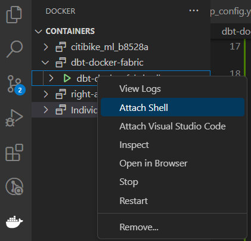
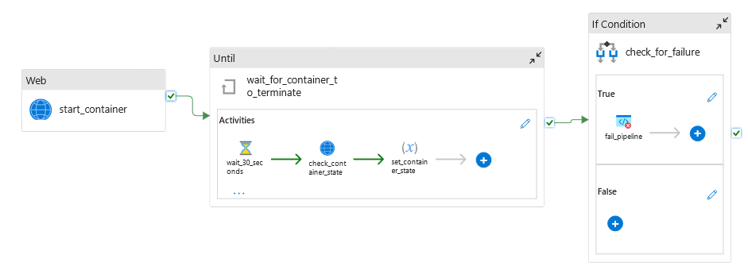

# dbt on Azure Container Instances

## Pre-requisites
- [Docker](https://docs.docker.com/get-docker/)
- [Azure CLI](https://docs.microsoft.com/en-us/cli/azure/install-azure-cli)
- VS Code with the following extensions:
    - [Azure Account](https://marketplace.visualstudio.com/items?itemName=ms-vscode.azure-account)
    - [Azure Container Apps](https://marketplace.visualstudio.com/items?itemName=ms-azuretools.vscode-azurecontainerapps)
    - [Docker extension](https://marketplace.visualstudio.com/items?itemName=ms-azuretools.vscode-docker)
- An Azure DevOps project with a remote repository and permissions to create service connections and pipelines.
- Permissions to create Azure resources and add IAM role assignments.
## Initial setup

1. Add the `Dockerfile` and `docker-compose.yml` files to the root of your project.
1. Create a `requirements.txt` file in the root of your project and add the package for the dbt adapter you will be using (dbt-snowflake, dbt-sqlserver, etc.).
1. Modify the `Dockerfile` based on the dbt adapter you will be using. The file in this repo can be used with dbt-fabric, dbt-sqlserver, and dbt-synapse.
    - If you are using Snowflake, you can remove the ODBC installation lines.
    - Other examples can be found [here](https://github.com/dbt-labs/dbt-core/blob/main/docker/Dockerfile)
1. Create a `.env` file in the root of your project with any parameterized variables you will be using in your dbt project. For example:
    ```
    DBT_FABRIC_SERVER=myinstance.datawarehouse.pbidedicated.windows.net
    DBT_ENV_SECRET_FABRIC_USER=me@mydomain.com
    DBT_ENV_SECRET_FABRIC_PASSWORD=My53cur3P@ssw0rd
    DBT_FABRIC_DATABASE=my_database
    ```
1. Add a `dbt` folder to the root of your project and create a new dbt project or add your dbt project files.
1. Add a `profiles.yml` file to the `dbt` folder and update it with your dbt profile information, including any of the `.env` values you will be using (see the [profiles.yml](dbt/profiles.yml) file in this repo for an example).
    - *Note: Parameterized values that include sensitive information such as passwords should be named with the prefix `DBT_ENV_SECRET_` . This will prevent dbt from logging those values.*
1. In the terminal, run `docker compose up -d --build` from the project root to build the container and start the instance locally.
1. Once the container is running, you can go to the Docker extension menu, right click on the container, and select `Attach Shell` to run dbt commands from the terminal. 
    

## Manually publish to Azure Container Registry
1. From VS Code, sign in to your Azure Account (`Ctrl + Shift + p` -> `Azure: Sign in`).
1. Right click on the `Dockerfile` in VS Code Explorer and select **Build Image in Azure**.
1. Follow the prompts. From the menu, you will be able to select an existing Azure Container Registry or create a new one.

## Configure the Azure Container Registry for your project
1. From the Azure Portal, go to the Azure Container Registry resource.
1. Select **Settings > Access Keys** from the left menu.
1. Enable **Admin user** and copy the server name, username and password.
1. Add the password to your `.env` file:
 
## Manually create an Azure Container Instance
1. Go to your resource group in the Azure Portal.
1. Select **Create** from the top menu and search for **Container Instances**.
1. Click the resource type and select **Create**.
1. Follow the setup flow, making sure to select the following:
    - Basics:
        - **Image Source**: Azure Container Registry
    - Advanced:
        - **Restart policy**: `Never`
        - **Environment Variables**: All environment variables you are using in your dbt project
        - **Commands**: `[ "/bin/bash", "-c", "dbt run" ]`
1. *Note: Your container will start and run any provided commands as soon as the instance has been created. In most scenarios, this means your dbt job will run and the container will shut down once the job has completed.*

## Set up CI/CD with Azure DevOps Pipelines
1. Update the last line of `devops/update_container.ps1` to match the name of your Azure Resource Group.
1. Update the following in `devops/container_app_config.yml`:
    - **name**: The name of your container instance
    - **location**: The Azure region for your container instance
    - **<span>containers.name</span>**: The name of your container
    - **containers.environmentVariables**: Any environment variables you are using in your dbt project.
    - **containers.image**: The full path to your image in Azure Container Registry, including container name and tag.
    - **imageRegistryCredentials**: The server, username and password (this should reference the previously created `.env` value) for your Azure Container Registry.
1. Add any changes to the remote repository.
1. Open your project in Azure DevOps and click *Project settings* to [create a service connection for Azure Pipelines](https://learn.microsoft.com/en-us/azure/devops/pipelines/library/service-endpoints?view=azure-devops&tabs=yaml#create-a-service-connection).
    - When creating the service connection, select **Azure Resource Manager** as the service connection type.
        - *Note: If an existing **Azure Resource Manager** connection already exists, you may be able to use it for this pipeline.*
1. Click on **Pipelines** in the left menu and select **New Pipeline**.
1. Select **Azure Repos Git** as the source.
1. Select the repository you want to use.
1. Select **Docker - Build and push an image to Azure Container Registry** as the template.
1. Select the **Container Registry** you want to use and update the Image Repository field to match the name of your image.
1. Once the `.yml` file has been created, click the **Show assistant** button to add a new task:
1. Select **Azure CLI** as the task type and add the following values.
    - **Azure Resource Manager connection**: Select the service connection you created earlier
    - **Script type**: PowerShell Core
    - **Script location**: Script path
    - **Script Path**: `devops/update_container.ps1`
1. Add the task to the pipeline.
1. Click on the **Variables** button and add any environment variables you are using in your project.
1. **Important**: *Any values where you select **Keep this value secret** will need to be mapped in order to be accessed by the Azure CLI task. For these variables you will want to use a different name than the one in your `.env` file*
1. Add the mappings to any secret variables in the directly to your pipeline yaml Azure CLI task in the following format:
``` yaml
    - task: AzureCLI@2
      env: 
        VARIABLE_NAME_IN_.ENV: $(VARIABLE_NAME_IN_PIPELINE) 
```
16. Optional: Update the `trigger` value in the pipeline yaml file to only trigger when dbt changes are pushed to the repository using:
``` yaml
trigger:
  branches:
    include:
      - main
  paths:
    include:
      - dbt/*
```
17. Click **Save** to commit your changes and create the pipeline.

## Use Azure Data Factory to trigger dbt

1. From your Container Instance resource in the Azure Portal, select **Access Control (IAM)** and add your Data Factory managed identity as a **Contributor**.
1. From Data Factory, add a **Web** activity to start the container with the following settings:
    - URL: `https://management.azure.com/subscriptions/{subscriptionId}/resourceGroups/{resourceGroupName}/providers/Microsoft.ContainerInstance/containerGroups/{containerGroupName}/start?api-version=2021-03-01`
    - Method: POST
    - Body: `{}`
    - Authentication: System Assigned Managed Identity
    - Resource: `https://management.azure.com/`
1. Add string variables to the pipeline for `container_state` and `container_status` 
1. Add an **Until** loop to poll the container state and status with the **Expression** `@equals(variables('container_state'), 'Terminated')`
1. Inside the loop, add:
    - A **Wait** activity with a your desired polling interval.
    - A **Web** activity to poll the container with the following settings:
        - URL: `https://management.azure.com/subscriptions/{subscriptionId}/resourceGroups/{resourceGroupName}/providers/Microsoft.ContainerInstance/containerGroups/{containerGroupName}?api-version=2021-03-01`
        - Method: GET
        - Authentication: System Assigned Managed Identity
        - Resource: `https://management.azure.com/`
    - **Set Variable** activities to set the `container_state` and `container_status` variables (see [container_dbt_fabric.json](adf/pipeline/container_dbt_fabric.json) for an example).
1. Add an **If Condition** activity to check if the container status with the expression `@equals(variables('container_status'), 'Error')`.
1. Inside the **If true** branch, add a **Fail** activity.
